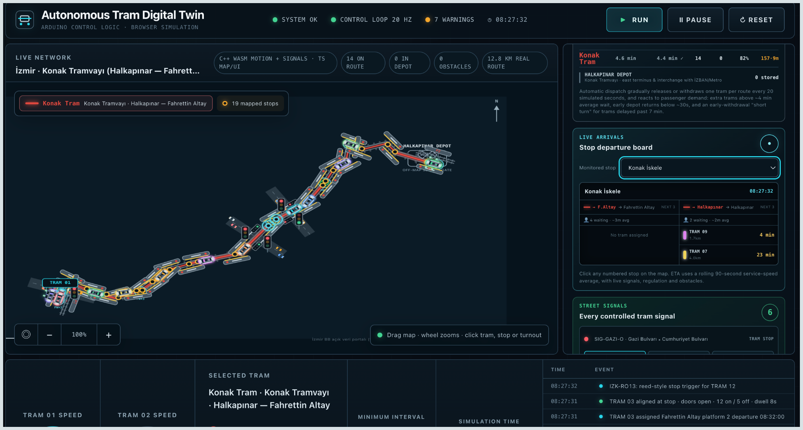

# Autonomous Tram Digital Twin

[](https://algordeev.github.io/autonomous-tram-digital-twin/)
[](README_RU.md)

An open research prototype for autonomous tram operations, passenger service,
network dispatch and traction-energy management.

The simulator combines a deterministic C++/WebAssembly control authority with
a TypeScript scenario and experiment layer and a React/Canvas interface. It
currently reproduces two interacting routes in Nizhny Novgorod and the Konak
Tram corridor in İzmir, including terminals, depots, passengers, switches,
signals, longitudinal dynamics, regenerative braking and wayside flywheel
storage.

> Research status: the software is suitable for controlled comparative
> experiments. Absolute energy results still require calibration against real
> vehicle and power-network measurements.



> This project extends the earlier
> [physical Arduino tram prototype](https://github.com/algordeev/autonomous-tram-system)
> into a scalable software digital twin for network-level operations,
> passenger-service and traction-energy experiments.

## What is implemented

| Area | Current implementation |
| --- | --- |
| Networks | Nizhny Novgorod Routes 2 and 21; İzmir Konak Tram |
| Operations | Multi-tram movement, no overtaking, temporal headways, terminal slots, depot entry/exit and disturbance recovery |
| Passenger service | Time-dependent demand, queues, 110-passenger capacity, boarding/alighting and variable dwell time |
| Infrastructure | Stops, RFID-style readers, tram signals, road crossings, turnout locks and conflict zones |
| Vehicle model | Passenger-dependent mass, force/power limits, jerk-limited acceleration and braking, resistance, gradients and curve/turnout speed limits |
| Energy | Direct regenerative reuse, traction sections, substations, rejected energy, grid peaks and VYCON-reference flywheel banks |
| Operations analysis | Live time–distance diagram with route selection, dwell markers, departure-lateness overlays and 10–60 minute windows |
| Experiments | Headless deterministic runs and no-storage/reactive/predictive energy comparisons |

## Implemented networks

| Scenario ID | Network | Geometry |
| --- | --- | ---: |
| `nizhny-route-2` | Route 2 city-centre ring | 39 directed segments |
| `nizhny-routes-2-21` | Interacting Routes 2 and 21 | 66 directed segments |
| `izmir-konak` | Halkapınar–Fahrettin Altay | 36 directed segments, 19 mapped stops |

Route 2 is represented as a ring. Route 21 shares central infrastructure with
Route 2 and therefore exercises mixed-route ordering, turnout conflicts and
independent service regulation. İzmir includes two terminal berths and a
controlled Halkapınar depot.

## Quick start

Requirements:

- Node.js 22.13 or newer;
- npm 10 or newer;
- a C++17 compiler and GNU Make for native-core tests.

```bash
npm ci
npm run dev
```

Open `http://localhost:5173`.

For an optimized static build:

```bash
npm run build
npm run preview
```

The generated `dist/` directory is deployable to GitHub Pages, Netlify,
Cloudflare Pages, Vercel or an ordinary static server. The app does not require a database or a server-side runtime.

## Tests

```bash
npm run check          # TypeScript and production build
npm test               # Fast TypeScript/WASM/config/UI regressions
npm run test:cpp       # Native C++ tests
npm run test:simulation
npm run test:izmir
```

Run the complete local verification set with:

```bash
npm run test:all
```

## Headless experiments

The complete simulation can run without React, DOM or Canvas:

```bash
npm run simulate:headless -- \
  --scenario izmir-konak \
  --tram-count 14 \
  --duration-hours 1 \
  --sample-seconds 60 \
  --output outputs/izmir-one-hour.json
```

The report contains service metrics, route operations, energy balance, event
counts and periodic samples. Programmatic experiments can use
`runHeadlessSimulation` and `runEnergyComparison` from
`src/simulation-core/headless.ts`.

## Architecture

```text
React + Canvas interface
        ↕ immutable render snapshots and operator commands
TypeScript scenario, passengers, ETA and experiment orchestration
        ↕ C ABI 11
C++ / WebAssembly authority
motion · braking · energy · signals · stops · doors · turnouts · depot
```

The C++ authority is intentionally independent from React. This allows the same
control boundary to be exercised in the browser, native tests, future MATLAB
validation and a hardware-in-the-loop adapter.

## Repository map

```text
src/                    Web application and TypeScript orchestration
  config/networks/      Portable JSON network configurations
  simulation-core/      Deterministic engine, passengers, energy and WASM adapter
cpp-core/               C++17 control authority, C ABI and native tests
public/wasm/            Browser-ready compiled C++ core
scripts/                Config generation, headless runner and PWA build helpers
tests/                  Deterministic web/core/scenario regression suites
docs/                   Architecture, models, assumptions and research documents
.github/                CI, Pages deployment and contribution templates
```

## Documentation

- [Documentation index](docs/README.md)
- [Architecture and control boundary](docs/ARCHITECTURE.md)
- [Implemented feature catalogue](docs/FEATURES.md)
- [Operations and dispatch](docs/OPERATIONS.md)
- [Time–distance diagram](docs/TIME_DISTANCE_DIAGRAM.md) 
- [Energy statistics screen](docs/ENERGY_SCREEN.md) 
- [Network configuration format](docs/NETWORK_CONFIGURATION.md)
- [Vehicle and energy models](docs/ENERGY_MODEL.md)
- [Data provenance and assumptions](docs/DATA_AND_ASSUMPTIONS.md)
- [Experiments and metrics](docs/EXPERIMENTS.md)
- [Hardware integration path](docs/HARDWARE_INTEGRATION.md)
- [Roadmap](docs/ROADMAP.md)
- [Russian documentation](docs/ru/README.md)

## Reproducibility and limitations

- The simulation uses a fixed 50 ms control step.
- Network configurations are versioned JSON and validated before use.
- Public substation addresses/counts are distinguished from estimated feeder
  boundaries and reconstructed positions.
- İzmir energy values are comparative until the vehicle is calibrated against
  the Hyundai Rotem fleet and measured T2 data.
- Cable resistance, voltage sag, detailed DC load flow and exact converter maps
  are not yet represented.

See [Data provenance and assumptions](docs/DATA_AND_ASSUMPTIONS.md) for the
complete evidence classification.

## Contributing and citation

Read [CONTRIBUTING.md](CONTRIBUTING.md) before opening a pull request. Academic
users can cite the project using [CITATION.cff](CITATION.cff).

## License

The repository is currently marked `UNLICENSED` while the public-use licence is
being selected. Source visibility alone does not grant permission to reuse or
redistribute the code. Add an OSI-approved `LICENSE` before inviting external
reuse.
