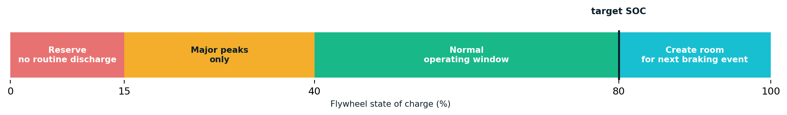

# Vehicle and Energy Models

## Longitudinal vehicle model

The fixed-step model is one-dimensional. At each step it computes the requested
acceleration, applies jerk and acceleration limits, evaluates resistance and
grade force, then limits traction by force and power.

```text
F_required = m·a + (A + B·v + C·v²) + m·g·grade
P_traction = F_traction·v / drivetrain_efficiency
E = integral(P·dt)
```

All internal values use SI units.

## Reference parameters

| Parameter | Value | Evidence status |
| --- | ---: | --- |
| Empty reference mass | 27,500 kg | Original Route 2 study value |
| Maximum traction force | 32 kN | Engineering assumption |
| Maximum braking force | 52 kN | Engineering assumption |
| Maximum traction power | 240 kW | Engineering assumption |
| Maximum acceleration | 1.15 m/s² | Plausibility-checked public tram range |
| Service deceleration | 1.25 m/s² | Plausibility-checked public tram range |
| Emergency deceleration | 2.40 m/s² | Engineering safety model |
| Maximum jerk | 0.90 m/s³ | Comfort-oriented assumption |
| Drivetrain efficiency | 88% | Engineering assumption |
| Regeneration conversion | 86% | Engineering assumption |
| Section receptivity | 82% | Original model assumption |
| Auxiliary demand | 4.5 kW | Engineering assumption |

Passenger mass is added to the base mass before dynamics and energy are
integrated. Resistance follows an `A + Bv + Cv²` form. Segment gradients add
`m·g·grade`; curve and turnout profiles restrict target speed before entry.

## Braking energy

The simulator distinguishes:

1. mechanical braking energy at the wheel;
2. generator output after regenerative conversion;
3. energy directly consumed by accelerating trams in the same section;
4. energy stored in a flywheel bank;
5. energy rejected when no receptive load or storage capacity exists.

These quantities must not be reported interchangeably.

## Traction sections

Each vehicle belongs to one electrical section. Every 50 ms the model sums:

- traction and auxiliary load;
- regenerative generator output;
- direct local reuse;
- flywheel charge/discharge and losses;
- residual grid supply;
- rejected regeneration;
- instantaneous and observed peak power.

Energy transfer between electrical sections is currently disabled.

## Flywheel reference

The storage model references the VYCON REGEN wayside module:

| Property | Per module |
| --- | ---: |
| Rated power | 125 kW |
| Usable energy reference | 1,875 kW·s = 0.520833 kWh |
| Rotor range | 10,000–20,000 rpm |

SOC is derived from rotor kinetic energy and therefore rotor speed squared:

```text
SOC = (rpm² - rpm_min²) / (rpm_max² - rpm_min²)
```

Nizhny uses 38 modules across the complete network. Because the simulated
contact network is 600 V and the reference bank is 750 V, charge and discharge
each include a 95% interface efficiency. İzmir uses 18 modules across six 750 V
sections. The same 95% interface efficiencies are retained as a transparent
comparison assumption, not a claim about a specific installed converter.

## SOC controller



| SOC band | Discharge policy |
| --- | --- |
| 0–15% | Reserved; no routine traction support |
| 15–40% | Used only against a serious power peak |
| 40–80% | Normal peak-limiting operation |
| Above 80% | Supplies available traction until approximately 80% to create braking headroom |

The controller forecasts section traction and regeneration from current and
target speed. When braking is expected and SOC is sufficiently high, it can
lower the target grid threshold and create capacity in advance.

## Energy strategies

- `no-storage`: traction sections and direct reuse remain, but flywheel storage
  is disabled;
- `baseline`: reactive flywheel charge and discharge without vehicle guidance;
- `network-optimal`: predictive SOC/peak logic may soften acceleration when a
  grid peak is not served by local regeneration.

Signals, obstacles, safe distance, doors and stop authority always override
energy guidance.

## Elevation

Eight measured elevation differences are assigned to directed Route 2 segments.
Their total descending elevation is 102 m. For a 27.5 t vehicle:

```text
mgh = 27,500 · 9.80665 · 102 = 27.51 MJ = 7.64 kWh
```

The earlier project presentation stated 7.84 kWh. With the parameters currently
encoded in the simulator, the dimensionally consistent result is 7.64 kWh.
Applying 86% conversion and 82% receptivity gives an indicative accepted ceiling
near 5.39 kWh when a consumer or storage capacity is available. Route 21
inherits the gradient on shared track; its private branch is currently level.

## Not yet modelled

- feeder and return-circuit resistance;
- voltage sag and current-dependent power limits;
- detailed DC load flow and section interconnection;
- measured converter efficiency maps;
- thermal limits and storage degradation;
- calibrated Hyundai Rotem İzmir vehicle parameters.
