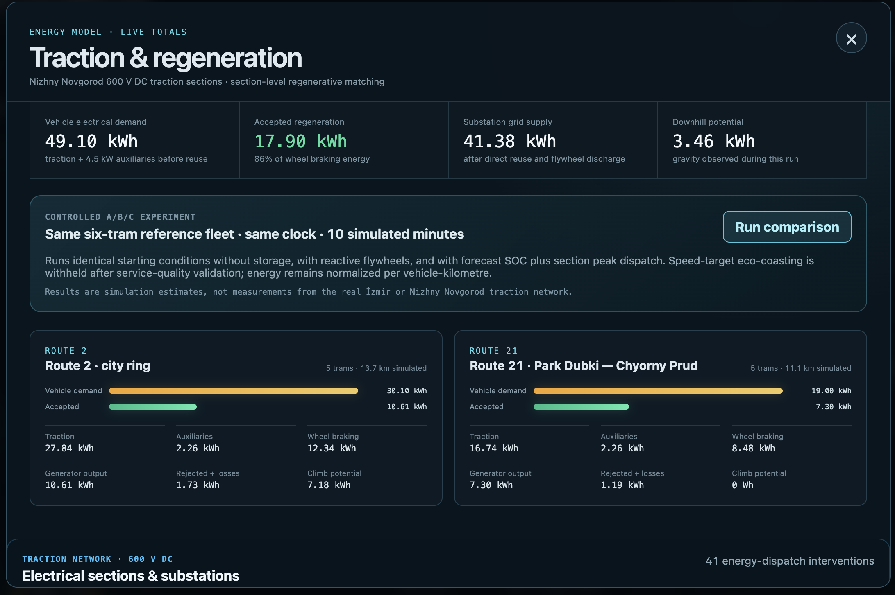
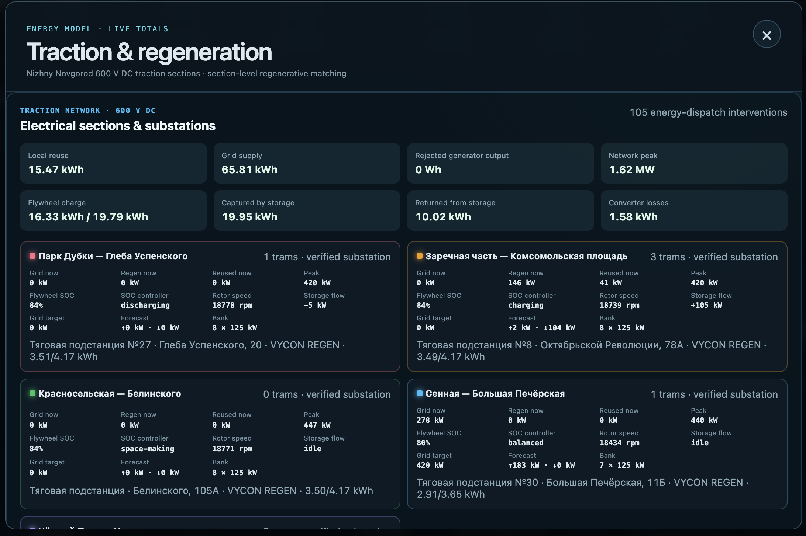
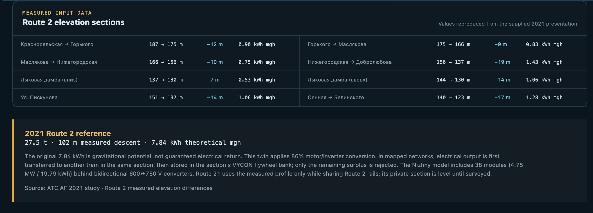

# Energy Statistics Screen

Open **Energy** in the main toolbar, or click the **VYCON REGEN** storage card in
the operations desk. The **Traction & regeneration** window shows energy and
power statistics for the current scenario. Scroll inside the window to inspect
route totals, substations, flywheel banks and the Route 2 elevation reference.

*Example from a short Nizhny Novgorod Routes 2 + 21 run, paused for inspection. The
summary and route cards belong to that live run.*

## Live summary

| Card | Interpretation |
| --- | --- |
| Vehicle electrical demand | Traction and auxiliary electrical demand before regenerative reuse and storage support |
| Accepted regeneration | Braking energy accepted as electrical regeneration by the model; the percentage is relative to wheel braking energy |
| Substation grid supply | External supply after direct reuse and flywheel discharge |
| Downhill potential | Gravitational potential released on descending track during the run |

**Wh/kWh measure energy; kW/MW measure power.** These totals accumulate over the
run, whereas section fields labelled **now** describe the latest instantaneous
state. Pausing freezes the displayed values; it does not turn cumulative energy
into an average power measurement. Resetting the simulation starts new live
totals.

Vehicle demand and grid supply are different quantities. Accepted regeneration
is not automatically equivalent to energy saved at the grid: energy may be
stored, incur conversion losses or remain in the flywheel at the end of a run.
Interpret savings through a controlled comparison with equal starting
conditions.

## Route balances

Each route card shows its tram count, simulated vehicle-kilometres, demand and
accepted regeneration, followed by these components:

| Field | Meaning |
| --- | --- |
| Traction | Electrical energy used for propulsion |
| Auxiliaries | Auxiliary loads, including consumption while stationary |
| Wheel braking | Mechanical energy available from braking; not electrical energy returned to the grid |
| Generator output | Electrical regeneration after motor/inverter conversion |
| Rejected + losses | Energy not counted as accepted electrical regeneration, including conversion loss |
| Climb potential | Gravitational potential gained while climbing |

The horizontal bars compare demand and accepted regeneration **within each
route card**. They use that route's demand as their scale, so equal bar lengths
on different cards do not imply equal kWh.

## Sections, substations and flywheels

*Section details captured later in the same simulation, paused again. The complete cards show different
charging/idle states and SOC values.*

The network summary distinguishes **Local reuse**, **Grid supply**, **Rejected
generator output** and **Network peak**. Storage fields distinguish the energy
currently held (**Flywheel charge**, shown against capacity), cumulative energy
captured and returned, and converter losses. Initial stored energy is part of
the run's starting conditions; current stored energy is not the same as energy
captured during this run.

| Section field | Meaning |
| --- | --- |
| Grid now / Regen now / Reused now | Instantaneous supply, regeneration and direct local reuse |
| Peak | Highest grid power observed for that section during the run |
| Flywheel SOC | Stored energy as a percentage of bank capacity |
| SOC controller | Current storage-control mode, such as charging, peak-only etc |
| Rotor speed | Modelled flywheel speed in rpm |
| Storage flow | Positive charge power, negative discharge power, or idle |
| Grid target | Controller's current target threshold for section grid power |
| Forecast | Predicted traction demand (↑) and regenerative availability (↓) |
| Bank | Number of 125 kW modules in that section |

Read the [energy model](ENERGY_MODEL.md) for SOC policy, conversion assumptions
and the differences between the 600 V Nizhny Novgorod and 750 V Izmir networks. A
verified substation address does not validate the full electrical network model;
see [Data and assumptions](DATA_AND_ASSUMPTIONS.md).

## Controlled A/B/C comparison

## Elevation reference and interpretation limits

The lower part of the window reproduces the Route 2 elevation study and its
2021 reference potential. The reference's 7.84 kWh is theoretical gravitational
potential, not guaranteed recovered electrical energy; the current model's
parameter calculation is explained in [Energy model](ENERGY_MODEL.md#elevation).

Screenshots show illustrative simulator states, not measured operator savings.
Absolute energy results still require vehicle and traction-network calibration.
