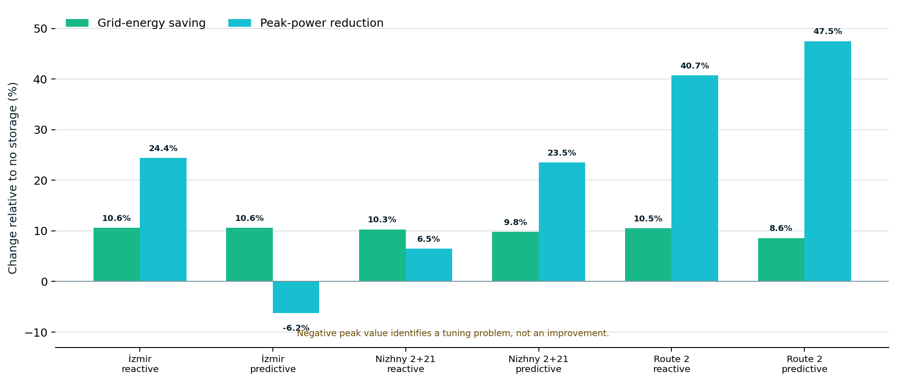

# Experiments and Metrics

## Headless simulation

Run a deterministic scenario without the interface:

```bash
npm run simulate:headless -- \
  --scenario nizhny-routes-2-21 \
  --tram-count 12 \
  --duration-hours 1 \
  --start-minute 480 \
  --sample-seconds 60 \
  --output outputs/nizhny-0800.json
```

The report schema is versioned as `schemaVersion: 1` and contains:

- requested and simulated duration;
- start/end service clock;
- final network metrics;
- route-level operations;
- energy statistics;
- event counts;
- periodic samples.

## Energy comparison

`runEnergyComparison` executes three identical service cases:

1. no wayside storage;
2. reactive flywheel storage;
3. predictive SOC and peak dispatch.

Energy saving is calculated using grid energy per vehicle-kilometre, not raw
grid kWh, so small strategy-dependent distance differences do not bias the
comparison.

```text
grid Wh/vkm = grid supply Wh / simulated vehicle distance km
energy saving = (reference - strategy) / reference · 100%
peak reduction = (reference peak - strategy peak) / reference peak · 100%
```

## Current reproducible benchmark



Ten simulated minutes, service start 08:00:

| Scenario and controller | Grid-energy saving | Peak-power reduction | Notes |
| --- | ---: | ---: | --- |
| İzmir, 14 trams, reactive | 10.6% | 24.4% | Storage-only baseline |
| İzmir, 14 trams, predictive | 10.6% | -6.2% | Peak logic requires tuning |
| Nizhny 2+21, 12 trams, reactive | 10.3% | 6.5% | Shared-network baseline |
| Nizhny 2+21, 12 trams, predictive | 9.8% | 23.5% | 120 interventions |
| Nizhny Route 2, 10 trams, reactive | 10.5% | 40.7% | Storage-only comparison |
| Nizhny Route 2, 10 trams, predictive | 8.6% | 47.5% | 83 interventions |

These are simulator outputs, not measured savings for either real operator. The
negative İzmir peak result is retained because it exposes a controller-tuning
problem.

## Service metrics

| Metric | Interpretation |
| --- | --- |
| Mean headway | Average time or route separation between consecutive vehicles |
| Headway CV | Standard deviation divided by mean headway; lower is more regular |
| Departure adherence | Share of planned terminal departures inside the tolerance window |
| Mean departure deviation | Mean absolute timing difference from the reserved slot |
| Average passenger wait | Estimated waiting time from queues and service state |
| Left behind | Passengers remaining because capacity was reached |
| Interventions | Energy-controller changes to vehicle traction guidance |

## Experimental discipline

- Compare one control variable at a time.
- Hold scenario, fleet, service clock and duration constant.
- Report distance-normalized energy and absolute peak power.
- Preserve negative or inconvenient results.
- Repeat future stochastic experiments with disclosed seeds and confidence
  intervals.
- Separate calibration data from validation data.

