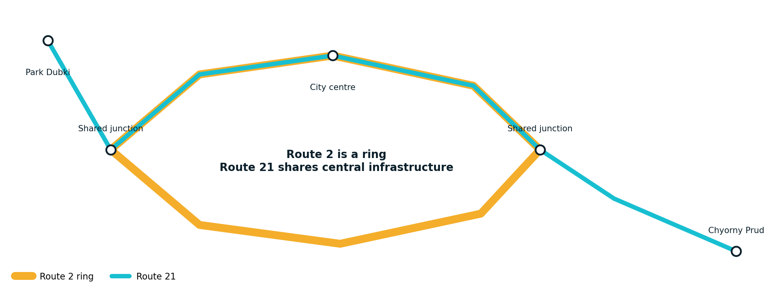

# Implemented Feature Catalogue

## Network scenarios

| Feature | Nizhny Route 2 | Nizhny Routes 2 and 21 | İzmir Konak Tram |
| --- | :---: | :---: | :---: |
| Bidirectional operation | Yes | Yes | Yes |
| Ring route | Yes | Route 2 | No |
| Shared-route conflicts | No | Yes | No |
| Depot entry and exit | Yes | Yes | Yes |
| Dual-platform terminal | No | No | Yes |
| Gradients | Eight Route 2 differences | Shared Route 2 profile | Not calibrated; level |
| Traction sections | 3 aggregated | 5 | 6 |
| Flywheel modules | 38 | 38 | 18 |

## Vehicle operation

- Multiple active trams with deterministic state updates;
- no overtaking and safe-distance authority;
- obstacle detection, service braking and emergency braking;
- smooth jerk-limited station approach;
- platform-aligned stopping and door authority;
- curve and turnout speed profiles;
- passenger mass added to the physical vehicle mass;
- manual control constrained by safety rules.

## Stops and passengers

- Time-of-day passenger arrival demand;
- stop-importance weighting;
- boarding, alighting and retained overflow;
- 110-passenger vehicle capacity;
- three-door dwell calculation between 8 and 45 seconds;
- two-direction ETA boards based on route geometry and live operation;
- door opening only at a valid stop dwell and near-zero speed.

## Dispatch and disruption response

- Peak and off-peak target fleets;
- planned terminal departure slots;
- temporal terminal headway checks;
- in-service anti-bunching speed authority;
- depot withdrawal and release;
- demand-triggered emergency extra tram;
- short-turn and tactical siding states;
- two-berth İzmir terminal assignment and entry queue.

## Infrastructure

- Directed segments and explicit route sequences;
- RFID-style readers and stop triggers;
- automatic turnout selection and locking;
- rail conflict zones;
- tram priority at road intersections;
- road-traffic red phase held until the tram clears;
- manual turnout and signal experiments.

## Energy and analytics

- Traction, auxiliary and mechanical braking energy;
- accepted and rejected regeneration;
- direct tram-to-tram reuse inside a section;
- substation/grid supply and peak power;
- flywheel charging, discharge, losses, SOC and rotor speed;
- reactive and predictive storage strategies;
- route-level and network-level energy totals;
- deterministic comparison mode and JSON reports.

## Verification map

| Test suite | Main coverage |
| --- | --- |
| `vehicle-dynamics.test.mjs` | Force/power limits, braking and energy integration |
| `passenger-model.test.mjs` | Queues, boarding and capacity |
| `wasm-core.test.mjs` | Browser C++ authority and ABI behaviour |
| `network-config.test.mjs` | Portable JSON validity and references |
| `simulation.test.mjs` | Full Nizhny operations and regressions |
| `izmir-scenario.test.mjs` | İzmir route, terminals, signals and obstacles |
| `rendered-html.test.mjs` | Standalone production output |
| `cpp-core/tests` | Native controllers and graph behaviour |
