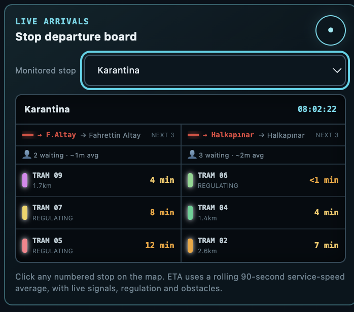

# Operations and Dispatch

## Service plan

Each route has time-dependent planned fleet size and headway. The dispatcher
approaches the target gradually so a short passenger fluctuation does not cause
continuous depot cycling.

At a dispatching terminal, a departure is measured against a planned slot. The
current on-time tolerance is ±60 seconds. A following tram is not released when
its temporal gap is below 85% of the planned headway.

## Headway regulation

Two controls serve different purposes:

1. **Terminal control** uses time between departures. It restores the service
   pattern where waiting is operationally acceptable.
2. **In-service control** uses live separation along the route to prevent
   bunching and unsafe following. It can reduce speed but cannot override a
   signal, obstacle, door or turnout restriction.

Headway coefficient of variation is reported as:

```text
Headway CV = standard deviation of observed headways / mean headway
```

Lower values indicate more regular service. Zero represents perfectly equal
intervals.

## Nizhny Novgorod terminal policy

- Park Dubki is the full dispatching terminal for Route 21. It supports planned
  departure holding, interval recovery and longer layover.
- Chyorny Prud is a quick turnback on shared infrastructure: passengers alight
  and board, the minimum turnback is completed and the tram leaves promptly so
  Route 2 is not unnecessarily blocked.
- Route 2 remains a ring and is regulated through its service plan and spacing
  rather than a long terminal layover at Chyorny Prud.

## Izmir terminal policy

Fahrettin Altay and Halkapınar are represented with two terminal berths. The
first two arrivals may occupy separate platforms. A third arrival receives no
berth and waits at the terminal entry; vehicles cannot overlap on one platform.

## Depot control

Depot movement is an explicit state machine:

```text
passenger service → inbound → in depot → outbound → passenger service
```

Portals and occupied-track checks prevent instantaneous appearance or release
onto an occupied main line. A vehicle ceases passenger service during depot
movement.

## Emergency extra tram

The current demand-response rule authorizes one extra vehicle when estimated
average passenger waiting exceeds 10 minutes continuously for 5 minutes. The
authorization lasts 20 minutes. A 15-minute cooldown prevents repeated release
and withdrawal around the threshold.

## Passenger and dwell model

Passenger arrivals depend on service time and stop weight. The queue is not
discarded when a tram fills. Vehicle capacity is 110 passengers. Boarding and
alighting through three doors produce an 8–45 second dwell.

The stop controller opens doors only when the vehicle is in passenger service,
is within a valid stop dwell and is effectively stationary. Departure remains
blocked until dwell completion.

## ETA boards



*Example stop board for Karantina stop in Izmir*

ETA uses directed route distance, rolling service speed and current operational
state. Signals, regulation, obstacles and terminal turns influence the result.
Each board separates the two travel directions; paired platforms may share one
panel while retaining their public names.

## Priority order

Operational optimization is subordinate to safety:

1. obstacle and emergency braking;
2. occupied track, conflict zone and safe following;
3. signal and turnout authority;
4. stop and door authority;
5. terminal and headway regulation;
6. energy optimization and eco guidance.
