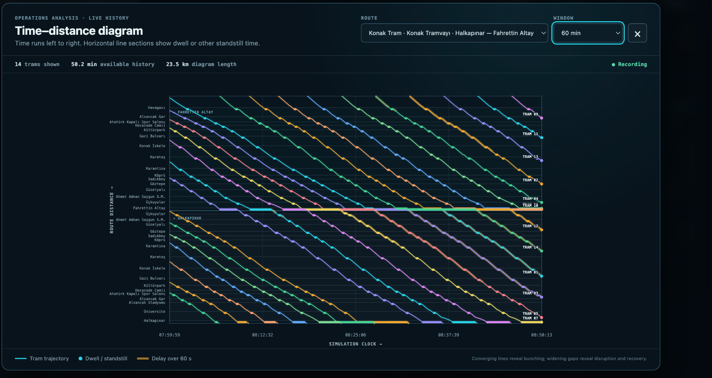

# Time–distance Diagram

*Route 21 after a short startup run. Values and vehicle positions are examples,
not a service-performance benchmark.*

Open **Time–distance** in the main toolbar to inspect recent tram movements.
Choose a route and a **10, 20, 30 or 60 minute** window; the default is 20
minutes. The diagram updates as the simulation runs. Pausing the simulation
freezes its clock and trajectories so they can be inspected.

## Reading the diagram

| Element | Meaning |
| --- | --- |
| Horizontal axis | Simulation clock, increasing from left to right |
| Vertical axis | Distance along the selected directed route sequence |
| Stop labels and horizontal reference lines | Stop positions on that sequence |
| Direction bands | Travel-direction sections of the route |
| Coloured trajectory and end label | A tram's recorded movement and vehicle number |
| Horizontal trajectory section | Dwell or another standstill, including terminal waiting |
| Steeper trajectory section | Faster progress along the route for the same time scale |
| Amber overlay | Departure lateness greater than 60 seconds |

For an out-and-back route, both directions are unfolded into one continuous
route-distance axis. Its displayed length covers the full route sequence, not
just the one-way corridor. A new cycle is drawn separately at the wraparound;
it is not connected by a line across the entire chart.

Compare time gaps between trajectories **at the same route position**. Roughly
parallel, evenly spaced lines indicate regular service. Narrowing gaps can
reveal bunching; widening gaps can reveal disruption or recovery. Several
horizontal lines at a terminal may represent a planned queue or layover. Check
the following departures before treating that pattern as a dispatch failure.

## Meaning of departure lateness

The amber overlay uses the same scheduled departure slots as the departure
statistics. While a tram has a reserved slot, lateness is the positive time
elapsed beyond that slot. Waiting before the slot is due contributes no
lateness. After departure, the actual positive departure deviation remains
attached to that trip until a new slot is assigned. Returning to the depot
clears the previous departure deviation. Without a known scheduled departure,
no amber overlay is shown.

This is **departure lateness**, not a continuously updated estimate of lateness
at every stop. The current model has no intermediate-stop timetable, so the
overlay cannot show delays acquired or recovered during the trip. It does not
use the distance-based `delaySeconds` heuristic. The on-time departure tolerance
is ±60 seconds, while the overlay specifically highlights late departures
beyond +60 seconds; early departures are not highlighted.

## History and scope

Only trams in passenger service are sampled, at most once per simulated second.
History is collected while the main application is open, even when the diagram
is closed. The application retains up to 60 simulated minutes, subject to a
60,000-sample cap; large fleets may therefore have less history available. The
summary reports the history actually available.

History clears when the scenario changes, the simulation clock moves backwards
(for example after a reset), or the page reloads. These trajectories are a live
browser-session view and are not stored in the headless experiment reports.

## Suggested inspection workflow

1. Run the simulation long enough to collect the movement of interest.
2. Open **Time–distance**, choose a route and select a suitable time window.
3. Pause to inspect stop dwell, terminal queues and separation at a shared stop.
4. Compare departures after the terminal hold, rather than interpreting the
   queue alone as bunching.
5. Use the [energy screen](ENERGY_SCREEN.md) to inspect the same live run's
   electrical totals. 

See [Operations and dispatch](OPERATIONS.md) for terminal and headway rules.
